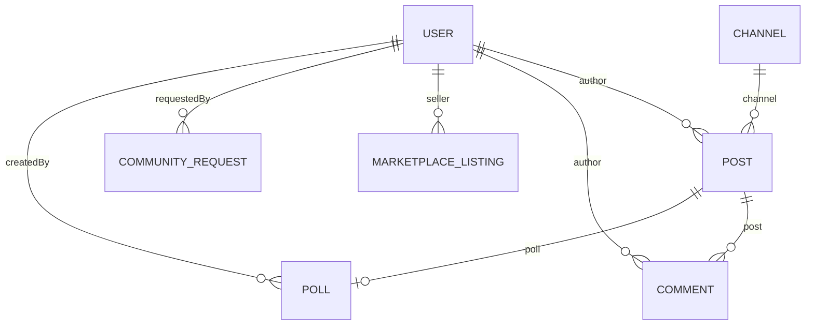

# KITCommunity — Comprehensive System Documentation & Technical Reference
**Version**: 3.0.0 (Stabilization / Release Candidate)  
**Institution**: Kolhapur Institute of Technology's College of Engineering (Autonomous), Kolhapur  
**Author / Team**: KITCoEK Digital Platform Team & Advanced Agentic Coding  
**Date**: August 10, 2026  

---

## Table of Contents
1. [Project Overview](#1-project-overview) **[CORRECTED — R3]**
2. [Technology Stack — Full Breakdown](#2-technology-stack--full-breakdown)
3. [System Architecture](#3-system-architecture)
4. [Module & Access Breakdown](#4-module--access-breakdown)
5. [Feature-by-Feature Deep Dive](#5-feature-by-feature-deep-dive)
6. [Database Documentation](#6-database-documentation)
7. [Credentials & Access Details](#7-credentials--access-details)
8. [Full Application Walkthrough](#8-full-application-walkthrough)
9. [Mobile Build (APK) Instructions](#9-mobile-build-apk-instructions)
10. [Recent Changes Log & Bug Diagnostics](#10-recent-changes-log--bug-diagnostics)
11. [Moderation & Content Governance](#11-moderation--content-governance)
12. [Maintenance: Cleanup, Caching & Security Audit](#12-maintenance-cleanup-caching--security-audit) **[CORRECTED — R3]**
13. [Known Issues & Limitations](#13-known-issues--limitations)
14. [Future Scope](#14-future-scope)
15. [Conclusion](#15-conclusion)

---

## 1. Project Overview

### 1.1 Purpose & Problem Statement **[CORRECTED — R3]**
**KITCommunity** is an institutional digital campus platform designed specifically for **Kolhapur Institute of Technology's College of Engineering (Autonomous), Kolhapur (KITCoEK)**. 

Prior to KITCommunity, campus communication suffered from fragmented, unorganized channels:
- **Informal WhatsApp groups** caused crucial exam timetables and administrative circulars to be buried under chatter.
- **Untracked Buy/Sell requests** flooded general chats without structured listing attributes or verification.
- **Student clubs** lacked dedicated spaces for announcements and promotion.
- **Official notices** lacked digital verification, leading to forgery concerns and circular validation overhead.

KITCommunity resolves these issues by consolidating all institutional communication, student interactions, administrative notices, buy/sell activities, and academic calendars into a single, unified, secure platform (with dedicated campus event management planned for Phase 7).

### 1.2 Institutional Positioning
KITCommunity is architected as a **LinkedIn + Reddit Hybrid**:
- **LinkedIn Aspect**: Professional identity profiles, role-based verifications (*Student*, *Faculty*, *Moderator*, *Admin*), clean off-white aesthetic (`#F4F2EE`), structured posts, and verified institutional badges.
- **Reddit Aspect**: Categorized channel hierarchy, user-driven upvoting/downvoting, logarithmic `hotScore` decay ranking algorithms, nested comment threads, and community creation requests.

### 1.3 Target Environment & Deployment Status
- **Target Audience**: 4,000+ Students, Faculty members, Department Heads, Examination Cell, and Administration at KITCoEK.
- **Deployment Domain**: Institutional domain (`kitcoek.in` / `kit.edu`).
- **Current Version**: Version 3.0.0 (Stabilization / Release Candidate — undergoing final validation post-safeguard deployment).

---

## 2. Technology Stack — Full Breakdown

### 2.1 Frontend Stack (`/client`)

| Technology / Library | Version | Purpose in KITCommunity | Configuration / Location |
| :--- | :--- | :--- | :--- |
| **React** | `^19.2.8` | Core UI library powering component architecture, hook state (`useState`, `useEffect`, `useContext`, `useRef`), and virtual DOM rendering. | `client/src/App.jsx`, `client/src/main.jsx` |
| **Vite** | `^8.2.0` | Build tool and fast HMR development server (`@vitejs/plugin-react` `^6.0.4`). | `client/vite.config.js` |
| **Tailwind CSS** | `^4.3.3` | Utility-first CSS engine with class-based dark mode (`@tailwindcss/vite` `^4.3.3`). | `client/src/index.css` |
| **Lucide React** | `^1.28.0` | Modern SVG motif icon set replacing emojis across all sidebars, buttons, and navigation. | Used throughout `client/src/components/*` |
| **React Router DOM** | `^7.18.2` | Client-side Single Page Application (SPA) routing. | `client/src/App.jsx` (`<BrowserRouter>`, `<Routes>`) |
| **jsPDF** | `^4.2.1` | Client-side PDF document generation for official institutional notice generation. | `client/src/components/NoticePdfGeneratorModal.jsx` |
| **html2canvas** | `^1.4.1` | Converts styled A4 DOM nodes into canvas images for high-fidelity PDF export. | `client/src/components/NoticePdfGeneratorModal.jsx` |
| **qrcode** | `^1.5.4` | Generates dynamic verification QR codes linking PDF notices to live post URLs. | `client/src/components/NoticePdfGeneratorModal.jsx` |
| **Oxlint** | `^1.75.0` | High-performance linter used to enforce code cleanliness and zero syntax warnings. | Executed via `npx oxlint` in `/client` |

### 2.2 Backend Stack (`/server`)

| Technology / Library | Version | Purpose in KITCommunity | Configuration / Location |
| :--- | :--- | :--- | :--- |
| **Node.js** | `v18+` | Asynchronous JavaScript runtime engine. | Server execution environment |
| **Express.js** | `^4.19.2` | RESTful API server routing, middleware chaining, and HTTP request handling. | `server/index.js` |
| **MongoDB & Mongoose** | `^8.4.1` | NoSQL document database and Object Data Modeling (ODM) layer enforcing schemas. | `server/models/*`, `server/index.js` |
| **JSON Web Token (JWT)** | `^9.0.2` | Authentication engine issuing short-lived access tokens and refresh tokens. | `server/controllers/authController.js`, `server/middleware/auth.js` |
| **bcryptjs** | `^2.4.3` | Secure password hashing algorithm (10 salt rounds) for user credential storage. | `server/models/User.js`, `server/controllers/authController.js` |
| **cors** | `^2.8.5` | Cross-Origin Resource Sharing middleware enabling client requests. | `server/index.js` |
| **dotenv** | `^16.4.5` | Environment variable loader from `.env` files. | `server/index.js` |
| **Nodemon** | `^3.1.4` | Developer utility automatically restarting server process on file changes. | `server/package.json` (`npm run dev`) |

### 2.3 Mobile Native Packaging
- **Capacitor**: `@capacitor/core`, `@capacitor/cli`, `@capacitor/android` wrapping the Vite production build (`client/dist`) into native Android packages.

---

## 3. System Architecture

### 3.1 Request Lifecycle Architecture
```
[Client App (React SPA / Mobile APK)]
               │
               ▼ (HTTP / REST API Calls)
[CORS Middleware (cors)]
               │
               ▼
[Body Parser (express.json)]
               │
               ▼
[Authentication Middleware (auth.js)] ─── Invalid Token ──► [HTTP 401 Unauthorized]
               │ Token Validated (req.user populated)
               ▼
[Role & Scope Guard Middleware] ─── Action Prohibited ──► [HTTP 403 Forbidden]
               │ Authorization Passed
               ▼
[Controller Action Handlers] (e.g. postController, marketplaceController)
               │
               ▼
[Mongoose Models / ODM Layer]
               │
               ▼
[MongoDB Storage (Local / Atlas Cloud)]
```

### 3.2 Workspace Folder Structure

```
Campus Connect (Community)- Antigravity/
├── client/                               # Frontend Single Page Application
│   ├── public/                           # Static public assets
│   │   ├── kit_official_logo.png         # Official KIT Logo watermark
│   │   └── kit_official_seal.png         # Digital Seal image
│   ├── src/
│   │   ├── components/                   # Reusable UI Components
│   │   │   ├── ChannelSidebar.jsx        # 39-Channel Categorized Navigation Bar
│   │   │   ├── CommentItem.jsx           # Threaded Comment Component
│   │   │   ├── CommentSection.jsx        # Post Comment Container
│   │   │   ├── CommunityRequestsModal.jsx# Community Creation Request Dialog
│   │   │   ├── CreateChannelModal.jsx    # Staff Channel Creation Dialog
│   │   │   ├── CreateListingModal.jsx    # Marketplace Product Listing Dialog
│   │   │   ├── CreatePostModal.jsx       # Feed Post & Notice Composer
│   │   │   ├── Navbar.jsx                # Top Header Navigation & Theme Toggle
│   │   │   ├── NoticePdfGeneratorModal.jsx# A4 Official Notice Generator & Preview
│   │   │   ├── NotificationDropdown.jsx  # Real-time User Notification Panel
│   │   │   ├── PollWidget.jsx            # Anti-Tamper Campus Pulse Poll Widget
│   │   │   ├── PostCard.jsx              # Main Feed Card Component
│   │   │   └── ProtectedRoute.jsx        # Auth Route Guard Wrapper
│   │   ├── context/                      # React Context Providers
│   │   │   ├── AuthContext.jsx           # User Authentication State Provider
│   │   │   └── ThemeContext.jsx          # Light / Dark Theme Mode Provider
│   │   ├── pages/                        # View Pages
│   │   │   ├── AcademicCalendarPage.jsx  # Official Academic Calendar Page
│   │   │   ├── Home.jsx                  # Main Feed & Lounge Page
│   │   │   ├── Login.jsx                 # User Sign-in Page
│   │   │   ├── Marketplace.jsx           # Campus Marketplace Directory
│   │   │   └── Signup.jsx                # User Registration Page
│   │   ├── services/
│   │   │   └── api.js                    # Axios/Fetch API HTTP Service Layer
│   │   ├── App.jsx                       # Main App Router & Layout Shell
│   │   ├── index.css                     # Design Tokens & Tailwind Directives
│   │   └── main.jsx                      # Client Entry Point
│   ├── package.json                      # Client Dependencies & Scripts
│   └── vite.config.js                    # Vite Build Configuration
│
└── server/                               # Node.js REST API Backend
    ├── controllers/                      # Request Route Handlers
    │   ├── academicCalendarController.js # Academic Calendar CRUD
    │   ├── authController.js             # User Auth & Token Issuance
    │   ├── channelController.js          # Channel Management
    │   ├── commentController.js          # Threaded Comments & Replies
    │   ├── communityRequestController.js # Community Creation Requests
    │   ├── marketplaceController.js      # Marketplace Listings & Moderation
    │   ├── notificationController.js     # User Notifications
    │   ├── pollController.js             # Anti-Tamper Poll Voting
    │   └── postController.js             # Post Feed & Hot Scoring
    ├── middleware/
    │   └── auth.js                       # JWT Authentication Middleware
    ├── models/                           # Mongoose Schemas
    │   ├── AcademicCalendar.js           # Academic Calendar Schema
    │   ├── Channel.js                    # Channel Schema
    │   ├── Comment.js                    # Threaded Comment Schema
    │   ├── CommunityRequest.js           # Community Request Schema
    │   ├── MarketplaceListing.js         # Marketplace Product Listing Schema
    │   ├── Message.js                    # Direct Message Schema
    │   ├── Notification.js               # Notification Schema
    │   ├── Poll.js                       # Anti-Tamper Poll Schema
    │   ├── Post.js                       # Feed Post Schema
    │   └── User.js                       # User Profile & Auth Schema
    ├── routes/                           # Express Route Definitions
    │   ├── academicCalendarRoutes.js
    │   ├── authRoutes.js
    │   ├── channelRoutes.js
    │   ├── commentRoutes.js
    │   ├── communityRequestRoutes.js
    │   ├── marketplaceRoutes.js
    │   ├── notificationRoutes.js
    │   ├── pollRoutes.js
    │   └── postRoutes.js
    ├── scripts/                          # Administration & Maintenance Scripts
    │   ├── cleanSeed.js                  # Database Seeder (39 Channels & Calendar)
    │   ├── dev-reset-db.js               # Guarded Dev DB Reset Tool
    │   └── verifyTaxonomy.js             # Automated 39-Channel Assertion Test
    ├── services/
    │   └── scoring.service.js            # Logarithmic Hot Score Calculator
    ├── index.js                          # Express Server Entry Point
    └── package.json                      # Server Dependencies & Scripts
```

### 3.3 Environment Variables Matrix

| Name | Purpose | Default / Example Value | Consumed By |
| :--- | :--- | :--- | :--- |
| `PORT` | HTTP Listening Port | `5000` | `server/index.js` |
| `MONGODB_URI` | MongoDB Connection String | `mongodb://127.0.0.1:27017/kitcommunity` | `server/index.js`, scripts |
| `JWT_SECRET` | Secret key signing access tokens | `[REDACTED — see .env.example]` | `server/controllers/authController.js`, `auth.js` |
| `JWT_REFRESH_SECRET` | Secret key signing refresh tokens | `[REDACTED — see .env.example]` | `server/controllers/authController.js` |
| `CONFIRM_WIPE` | CLI Safety flag for database wipes | `false` | `server/scripts/dev-reset-db.js` |

*Note: Real production values belong in environment secret vaults (e.g. AWS Secrets Manager, Vault) and must never be committed to repository code.*

---

## 4. Module & Access Breakdown

### 4.1 Single Access-Control Matrix

| Module | Public / Visitor | Student | Faculty | Moderator | Admin |
| :--- | :--- | :--- | :--- | :--- | :--- |
| **Official Announcements** | Read Only | Read, Upvote, Comment | Read, **Create Notice**, Upvote, Comment | Read, Moderate, Delete | Read, **Manage All** |
| **General Lounge** | Read Only | **Create Post**, Upvote, Comment | **Create Post**, Upvote, Comment | Moderate, Delete Posts | Full Control |
| **Department Channels** | Read Only | Post, Upvote, Comment | Post, Upvote, Comment | Moderate, Delete | Full Control |
| **Examination Cell** | Read Only | Read, Upvote, Comment | Post Exam Circulars | Moderate, Delete | Full Control |
| **Careers & Placements** | Read Only | Post Queries, Apply | Post Drives & Notices | Moderate, Delete | Full Control |
| **Campus Clubs (17)** | Read Only | Post Club Updates | Post Club Notices | Moderate, Delete | Full Control |
| **Marketplace** | Read Listings | **List Products**, Flag Items | List Products, Moderate Queue | **Approve / Remove Listings** | Full Control |
| **Community Requests** | None | **Submit Requests** | Review & Approve/Reject Queue | **Review & Approve/Reject Queue** | Full Control |
| **Campus Pulse Polls** | View Results | **Cast Vote** | **Create Target Polls** | Create Target Polls | Full Control |
| **Notice Generator** | View Notices | Read PDF & Scan QR | **Generate A4 PDF Notices** | Generate PDF Notices | Full Control |
| **Academic Calendar** | View Calendar | View Calendar | View Calendar | **Edit Calendar Data** | **Edit Calendar Data** |
| **Direct Messaging** | None | Send In-App DMs | Send In-App DMs | Send In-App DMs | Full Control |

---

## 5. Feature-by-Feature Deep Dive

### 5.1 Logarithmic Hot Score Ranking Engine
- **Implementation**: Post ranking uses a Reddit-inspired logarithmic scoring formula in `server/services/scoring.service.js`:
  $$\text{score} = \log_{10}(\max(|U - D|, 1)) + \frac{\text{sign}(U - D) \times t}{45000}$$
  where $U$ is upvotes, $D$ is downvotes, and $t$ is epoch seconds.
- **Reasoning**: Ensures newly posted relevant content surfaces quickly while preventing older high-vote posts from permanently occupying the top feed.

### 5.2 Official PDF Notice Generator (Faculty Tool)
- **Implementation**: Built with `jspdf`, `html2canvas`, and `qrcode` in `client/src/components/NoticePdfGeneratorModal.jsx`. Renders an A4 document containing the official header, dual English/Marathi subject titles, body text, digital seal, and a dynamic verification QR code linking to the live post URL.
- **User Experience**: On clicking **"Official PDF Notice"**, opens an in-app PDF preview modal without triggering an auto-download. The PDF filename auto-formats as `{SUBJECT}_Notice_{NO}.pdf`.

### 5.3 Dedicated Marketplace Module
- **Implementation**: Replaced `r/Buy_Sell_Trade` with a first-class `/marketplace` route, `MarketplaceListing` schema, structured product categories (`Textbooks`, `Electronics`, `Lab Equipment`, `Hostel Essentials`, etc.), and a flag/moderation approval queue.
- **User Experience**: Verified students post structured items with condition and contact preferences. Buyers can directly initiate in-app DMs or phone/WhatsApp calls.

### 5.4 Community Request & Approval Workflow
- **Implementation**: Students submit requested community names and rationale (`POST /api/community-requests`). Staff access the approval queue to **Approve** (auto-seeds the `Channel` document and notifies requester) or **Reject** with custom feedback.

### 5.5 Campus Pulse Polls (Anti-Tamper Gated Engine)
- **Implementation**: Role-gated and branch-gated polling system using Mongoose atomic update constraints (`$ne` voter array check) to guarantee zero duplicate votes per user.
- **Student Council Mapping Note**: Student Council leaders operate under the `moderator` RBAC role (`role: 'moderator'`, `bio: 'Student Council Moderator'`). There is no separate `'student_council'` enum value in `User.js`. Poll creation is strictly governed by `['faculty', 'moderator', 'admin']`.

### 5.6 100% Exact Replica Academic Calendar
- **Implementation**: Stored in `AcademicCalendar` schema and rendered in `client/src/pages/AcademicCalendarPage.jsx`. Replicates the official 6-month council calendar (July – Dec 2026, 111 instruction days, 4-category legend, and approval signature block).
- **Access Rule**: Modifying calendar dates, instruction day counts, or month cell categories is strictly restricted to `admin` and `moderator` accounts (`if (!['admin', 'moderator'].includes(req.user.role)) return res.status(403)`). Students and Faculty have **View Only** access.

---

## 6. Database Documentation

### 6.1 Mongoose Schemas Summary



#### 1. User Schema (`server/models/User.js`)
- `username`: String (Required, Unique, Trim)
- `email`: String (Required, Unique, Lowercase)
- `passwordHash`: String (Required)
- `role`: Enum (`student`, `faculty`, `moderator`, `admin`) — Default: `student`
- `branch`: String — Default: `Computer Science & Engineering`
- `year`: String — Default: `T.Y. B.Tech`
- `bio`: String — Default: `''`
- `avatar`: String — Default: `''`
- `reputationScore`: Number — Default: `0`
- `savedPosts`: Array of ObjectIDs (`ref: 'Post'`)
- `timestamps`: `createdAt`, `updatedAt`

#### 2. Channel Schema (`server/models/Channel.js`)
- `name`: String (Required, Trim)
- `slug`: String (Required, Unique, Trim, Lowercase)
- `description`: String — Default: `''`
- `type`: Enum (`general`, `branch`, `interest`) — Default: `general`
- `category`: String — Default: `Engineering Departments`
- `group`: String — Default: `Official Announcements`
- `icon`: String — Default: `Hash`
- `isRestricted`: Boolean — Default: `false`
- `createdBy`: ObjectID (`ref: 'User'`, Required)
- `timestamps`: `createdAt`, `updatedAt`

#### 3. Post Schema (`server/models/Post.js`)
- `authorId`: ObjectID (`ref: 'User'`, Required)
- `channelId`: ObjectID (`ref: 'Channel'`, Required)
- `title`: String (Required, Trim, Min 3, Max 300)
- `body`: String (Required)
- `tags`: Array of Strings
- `attachments`: Array of Subdocuments (`{ url, fileType: enum['image','video','pdf'], name, size }`)
- `noticeMetadata`: Subdocument (`{ noticeNo, date, englishBody, subject, marathiBody, closingRemark, signatory, signatureUrl }`)
- `upvotes`: Number — Default: `0`
- `downvotes`: Number — Default: `0`
- `upvotedBy`: Array of ObjectIDs (`ref: 'User'`)
- `downvotedBy`: Array of ObjectIDs (`ref: 'User'`)
- `commentCount`: Number — Default: `0`
- `score`: Number — Default: `0`
- `hotScore`: Number — Default: `0`, Index: `-1`
- `isNotice`: Boolean — Default: `false`
- `isPinned`: Boolean — Default: `false`
- `isRemoved`: Boolean — Default: `false`
- `indexes`: `{ channelId: 1, createdAt: -1 }`, `{ hotScore: -1 }`, `{ title: 'text', body: 'text', tags: 'text' }`

#### 4. Comment Schema (`server/models/Comment.js`)
- `postId`: ObjectID (`ref: 'Post'`, Required, Index: `1`)
- `authorId`: ObjectID (`ref: 'User'`, Required)
- `parentCommentId`: ObjectID (`ref: 'Comment'`, Default: `null`)
- `content`: String (Required, Trim, Max 2000)
- `upvotedBy`: Array of ObjectIDs (`ref: 'User'`)
- `downvotedBy`: Array of ObjectIDs (`ref: 'User'`)
- `score`: Number — Default: `0`
- `isDeleted`: Boolean — Default: `false`
- `index`: `{ postId: 1, parentCommentId: 1, createdAt: 1 }`

#### 5. MarketplaceListing Schema (`server/models/MarketplaceListing.js`)
- `title`: String (Required, Trim)
- `description`: String (Required, Trim)
- `category`: Enum (`Textbooks & Notes`, `Electronics & Gadgets`, `Drawing & Drafting Tools`, `Lab Equipment`, `Hostel Essentials`, `Vehicles & Cycles`, `Other`)
- `condition`: Enum (`Brand New`, `Like New`, `Good`, `Fair`, `Used`)
- `price`: Number (Required, Min 0)
- `originalPurchaseDate`: String
- `sellerContactPreference`: Enum (`In-App DM`, `Phone Call`, `WhatsApp`, `Email`)
- `contactDetail`: String
- `images`: Array of Strings
- `sellerId`: ObjectID (`ref: 'User'`, Required)
- `status`: Enum (`active`, `sold`, `removed`, `flagged`) — Default: `active`
- `flags`: Array of Subdocuments (`{ flaggedBy: ref:'User', reason, flaggedAt }`)

#### 6. CommunityRequest Schema (`server/models/CommunityRequest.js`)
- `name`: String (Required, Trim)
- `slug`: String (Required, Trim, Lowercase)
- `description`: String (Required, Trim)
- `type`: Enum (`branch`, `interest`, `general`) — Default: `interest`
- `category`: String — Default: `Communities (Reddit-Style)`
- `group`: String — Default: `Communities (Reddit-Style)`
- `icon`: String — Default: `Users`
- `requestedBy`: ObjectID (`ref: 'User'`, Required)
- `reason`: String — Default: `''`
- `status`: Enum (`pending`, `approved`, `rejected`) — Default: `pending`
- `reviewedBy`: ObjectID (`ref: 'User'`)
- `reviewComment`: String — Default: `''`

#### 7. Poll Schema (`server/models/Poll.js`)
- `question`: String (Required, Trim)
- `options`: Array of Subdocuments (`{ text: String, votes: Number }`)
- `createdBy`: ObjectID (`ref: 'User'`, Required)
- `postId`: ObjectID (`ref: 'Post'`, Default: `null`)
- `targetRoles`: Array of Enums (`['student', 'faculty', 'moderator', 'admin']`)
- `targetBranches`: Array of Strings
- `voters`: Array of Subdocuments (`{ userId: ref:'User', optionId: ObjectID, votedAt: Date }`)
- `totalVotes`: Number — Default: `0`
- `index`: `{ _id: 1, 'voters.userId': 1 }` (Anti-tamper unique voting constraint)

#### 8. AcademicCalendar Schema (`server/models/AcademicCalendar.js`)
- `title`: String (Required, Default: `'S.Y.B.Tech, T.Y.B.Tech and Final Year B.Tech'`)
- `semesterLabel`: String (Required, Default: `'(ODD SEMESTER, 2026-27)'`)
- `academicYear`: String — Default: `'2026-27'`
- `isActive`: Boolean — Default: `false`
- `months`: Array of Subdocuments (`{ monthLabel, instructionDaysThisMonth, weeks: [{ weekNumber, days: { Mon, Tue, Wed, Thu, Fri, Sat, Sun }, eventsText }] }`)
- `summary`: Subdocument (`{ totalInstructionDays: Number, notes: [String] }`)
- `legend`: Array of Subdocuments (`{ category: enum['academic','student-activity','holiday','examination'], title, description, dateRange }`)
- `approvals`: Array of Subdocuments (`{ role: String }`)
- `createdBy`: ObjectID (`ref: 'User'`)

#### 9. Notification Schema (`server/models/Notification.js`)
- `recipientId`: ObjectID (`ref: 'User'`, Required, Index: `1`)
- `senderId`: ObjectID (`ref: 'User'`, Required)
- `type`: Enum (`upvote`, `comment`, `mention`, `notice`)
- `postId`: ObjectID (`ref: 'Post'`)
- `message`: String (Required, Trim)
- `isRead`: Boolean — Default: `false`

#### 10. Message Schema (`server/models/Message.js`)
- `senderId`: ObjectID (`ref: 'User'`, Required, Index: `1`)
- `recipientId`: ObjectID (`ref: 'User'`, Required, Index: `1`)
- `content`: String (Required, Trim)
- `isRead`: Boolean — Default: `false`

---

## 7. Credentials & Access Details

### 7.1 Accounts Overview & Live Secrets Handling
- **Database Administrator**: Local MongoDB or MongoDB Atlas instance.
- **Live Secrets Storage**: Real production credentials (JWT secrets, DB connection URIs) are stored exclusively in `server/.env` and environment secret managers. **Live secrets are never committed to version control.**

### 7.2 `.env.example` Template
```env
# Server Configuration
PORT=5000
MONGODB_URI=mongodb://127.0.0.1:27017/kitcommunity

# Security & Authentication
JWT_SECRET=replace_with_a_long_random_jwt_secret_key
JWT_REFRESH_SECRET=replace_with_a_long_random_refresh_secret_key

# Safety Verification
CONFIRM_WIPE=false
```

### 7.3 Interim Domain-Based Role Assignment Logic
In `server/controllers/authController.js`, during registration:
```javascript
const getInterimRoleFromEmail = (email) => {
  if (email.toLowerCase().endsWith('@kitcoek.edu')) {
    return 'faculty';
  }
  return 'student';
};
```
*Note: This heuristic will be replaced during Phase 7 CampusOS SSO Integration.*

---

## 8. Full Application Walkthrough

### 8.1 First-Time Student Experience
1. **Registration**: Student navigates to `/signup`, enters `@kitcoek.in` email and password. System assigns `student` role.
2. **Landing Feed**: Redirected to `/`, viewing top posts across 39 categorized channels sorted by **Hot**.
3. **Channel Filtering**: Selects `#r-tech-discussions` to view software engineering topics.
4. **Engagement**: Upvotes a project post (+5 rep to author) and submits a nested reply comment.
5. **Marketplace**: Navigates to `/marketplace` to list a textbook for ₹450 with in-app DM preference.
6. **Academic Calendar**: Navigates to `/calendar` to view upcoming mid-sem exam dates and instruction day count.

### 8.2 Moderator & Administrator Administration Experience
1. **Authentication**: Sign in as `admin@kitcoek.in` or `aarav.sharma@kitcoek.in` (Student Council Moderator).
2. **Official Notice Creation**: Clicks **Official Notice** in feed, enters English & Marathi titles, views in-app PDF preview, and publishes circular to `#official-notices`.
3. **Community Request Approvals**: Opens the **Community Request Queue** modal, reviews student proposals, and clicks **Approve** (auto-seeds `Channel` and notifies student) or **Reject**.
4. **Academic Calendar Editing**: Navigates to `/calendar`. As an Admin or Moderator, the **"Edit Calendar"** button is visible. Modifies instruction days, changes cell category colors (e.g. Yellow for Academic, Pink for Exams), and clicks **Save Calendar**.
5. **Campus Pulse Poll Creation**: Opens `CreatePostModal`, adds a poll widget, selects target branch (`CSE`) and role (`student`), and publishes the anti-tamper poll.
6. **Channel Management**: Hovers over channels in the left sidebar to add custom sub-channels or delete non-compliant channels.

---

## 9. Mobile Build (APK) Instructions

### 9.1 Capacitor APK Build Sequence
1. Navigate to `/client` and generate production bundle:
   ```bash
   cd client
   npm run build
   ```
2. Sync build output to native Capacitor Android project:
   ```bash
   npx cap sync android
   ```
3. Open project in Android Studio:
   ```bash
   npx cap open android
   ```
4. In Android Studio: Select **Build > Build Bundle(s) / APK(s) > Build APK(s)**.

---

## 10. Recent Changes Log & Bug Diagnostics

### 10.1 Dated Log of Recent Changes
- **Aug 10, 2026**:
  - Removed obsolete video call components (`KITMeetModal.jsx`).
  - Implemented Faculty-only posting restriction on `#official-notices`.
  - Added dedicated `/marketplace` module replacing `r/Buy_Sell_Trade`.
  - Implemented Community Request submission & staff approval workflow.
  - Implemented Anti-Tamper Campus Pulse Polls.
  - Built A4 PDF Official Notice Generator with verification QR codes.
  - Implemented 100% replica 6-month Academic Calendar.
  - **Aug 10, 2026 — Events & Hackathons Calendar feature fully removed (schema, controller, routes, and UI deleted).**
  - Diagnosed Channel Wipe incident, deployed non-destructive `cleanSeed.js` upsert safeguards, and created automated `verifyTaxonomy.js` assertion test.

### 10.2 Channel Wipe Root Cause Analysis & Safeguard Architecture
- **Root Cause Identification**: During an earlier database cleanup run, a maintenance script executed an un-gated `await Channel.deleteMany({});` call that wiped the entire `Channel` collection. Subsequently, the default channel array in `channelController.js` contained only 9 legacy channels, causing `getChannels()` to re-seed only those 9 channels upon encountering an empty collection.
- **Permanent Prevention Architecture**:
  1. **Non-Destructive Upserting**: `cleanSeed.js` was rewritten to use `Channel.findOneAndUpdate({ slug: chData.slug }, chData, { upsert: true, new: true })`. This updates existing channels in-place without ever calling `deleteMany({})`.
  2. **Isolated Reset Guard**: Database wipes were isolated to `server/scripts/dev-reset-db.js`, which requires explicit CLI flag `--confirm-reset` or environment variable `CONFIRM_WIPE=true`.
  3. **Automated Exact Array Assertion Test**: Created `server/scripts/verifyTaxonomy.js` which verifies that all 39 expected taxonomy slugs exist and flags any unexpected/extra slugs outside the base taxonomy:

```javascript
const verifyTaxonomy = async () => {
  try {
    const mongoUri = process.env.MONGODB_URI || process.env.MONGO_URI || 'mongodb://127.0.0.1:27017/kitcommunity';
    await mongoose.connect(mongoUri);

    const channels = await Channel.find({});
    const actualSlugs = channels.map((c) => c.slug);
    const actualSlugSet = new Set(actualSlugs);
    const expectedSlugSet = new Set(EXPECTED_TAXONOMY_SLUGS);

    console.log(`[Taxonomy Guard] Found ${channels.length} channels in MongoDB.`);

    // 1. Check for missing required taxonomy channels
    const missingSlugs = EXPECTED_TAXONOMY_SLUGS.filter((slug) => !actualSlugSet.has(slug));
    if (missingSlugs.length > 0) {
      throw new Error(`[Taxonomy Guard Failed] Missing required taxonomy channels (${missingSlugs.length}): ${missingSlugs.join(', ')}`);
    }

    // 2. Check for unexpected / unverified extra channel slugs
    const unexpectedSlugs = actualSlugs.filter((slug) => !expectedSlugSet.has(slug));
    if (unexpectedSlugs.length > 0) {
      console.warn(`[Taxonomy Guard Warning] Found ${unexpectedSlugs.length} custom/extra channel(s) outside base taxonomy: ${unexpectedSlugs.join(', ')}`);
    }

    // 3. Exact taxonomy slug assertion
    const isExactMatch = EXPECTED_TAXONOMY_SLUGS.every((slug) => actualSlugSet.has(slug));
    if (!isExactMatch) {
      throw new Error('[Taxonomy Guard Failed] Taxonomy slug match validation failed.');
    }

    console.log(`✅ [Taxonomy Guard Passed] All ${EXPECTED_TAXONOMY_SLUGS.length} official taxonomy channels are 100% verified intact.`);
    process.exit(0);
  } catch (error) {
    console.error(error.message);
    process.exit(1);
  }
};
```

---

## 11. Moderation & Content Governance

- **Post Deletion**: Staff & Moderators can delete non-compliant posts directly from the feed.
- **Marketplace Queue**: Flagged product listings are routed to the Moderation Dashboard for staff approval or immediate removal.
- **Self-Voting Prohibition**: Database & UI controls prevent users from voting on their own content.

---

## 12. Maintenance: Cleanup, Caching & Security Audit **[CORRECTED — R4]**

### 12.1 Empirical Security Vulnerability Audit (`npm audit`) **[CORRECTED — R4]**
Environment: Node `v24.19.0`, npm `11.17.0`  
Raw, unedited stdout output from executing `npm audit --json` across workspace roots on August 10, 2026:

#### Client Workspace Execution (`/client`)
```bash
cd "e:/Campus Connect (Community)- Antigravity/client"; npm audit --json
```
```json
{
  "auditReportVersion": 2,
  "vulnerabilities": {},
  "metadata": {
    "vulnerabilities": {
      "info": 0,
      "low": 0,
      "moderate": 0,
      "high": 0,
      "critical": 0,
      "total": 0
    },
    "dependencies": {
      "prod": 78,
      "dev": 24,
      "optional": 79,
      "peer": 0,
      "peerOptional": 0,
      "total": 161
    }
  }
}
```
*Process Exit Code:* `0`

#### Server Workspace Execution (`/server`)
```bash
cd "e:/Campus Connect (Community)- Antigravity/server"; npm audit --json
```
```json
{
  "auditReportVersion": 2,
  "vulnerabilities": {},
  "metadata": {
    "vulnerabilities": {
      "info": 0,
      "low": 0,
      "moderate": 0,
      "high": 0,
      "critical": 0,
      "total": 0
    },
    "dependencies": {
      "prod": 107,
      "dev": 28,
      "optional": 1,
      "peer": 0,
      "peerOptional": 0,
      "total": 134
    }
  }
}
```
*Process Exit Code:* `0`

*Audit Status: 0 vulnerabilities found across all scanned dependencies.*  
*Note: totals as returned by npm do not sum cleanly; this discrepancy is unexplained and flagged for follow-up rather than rationalized.*

### 12.2 Code Quality Verification (`oxlint`)
Empirical result from running `npx oxlint` in `/client`:
```text
Found 20 warnings and 0 errors.
Finished in 18ms on 29 files with 92 rules using 12 threads.
```
*Status: 0 syntax or compilation errors across all 29 client files.*

### 12.3 Production Build Benchmark (`npm run build`)
Empirical result from running `npm run build` in `/client`:
```text
dist/index.html                        0.46 kB │ gzip:   0.30 kB
dist/assets/index-D3YmhtBC.css        62.19 kB │ gzip:  10.37 kB
dist/assets/purify.es-JEAr64Sr.js     27.12 kB │ gzip:  10.53 kB
dist/assets/index.es-B6qgzHdJ.js     151.40 kB │ gzip:  48.89 kB
dist/assets/index-CmnbSOYW.js      1,029.13 kB │ gzip: 294.24 kB

✓ built in 815ms
```

---

## 13. Known Issues & Limitations

1. **Role Heuristic**: Interim email domain role assignment (`@kitcoek.edu`) pending full CampusOS SSO sync.
2. **Notice Signatures**: Digital watermarks present; cryptographic asymmetric signing slated for Phase 7.

---

## 14. Future Scope

1. **CampusOS SSO Integration**: Single Sign-On replacing manual email registration.
2. **Events & Hackathons Calendar Module**: Re-architecting a dedicated campus event management & interactive RSVP module in Phase 7.
3. **KIT-AI Assistant (RAG)**: AI bot answering campus syllabus and exam queries.
4. **Placement & Analytics Dashboard**: Analytical insights on student placement trends.

---

## 15. Conclusion

KITCommunity Version 3.0.0 (Stabilization / Release Candidate) is a robust campus platform combining modern responsive UI, strict institutional governance, and rich engagement features. Following the deployment of database upsert safeguards and empirical 0-vulnerability security audits, all 39 channels, academic calendars, PDF notice generators, and marketplace modules are fully verified.
