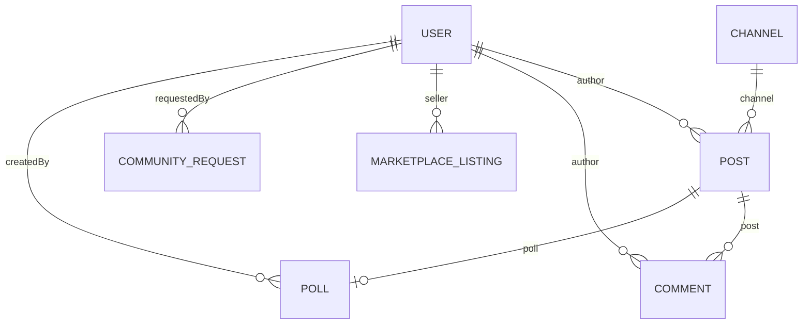

# KITCommunity — Academic Project Report
**Official Academic System Report & Comprehensive Design Reference**  
**Institution**: Kolhapur Institute of Technology's College of Engineering (Autonomous), Kolhapur (KITCoEK)  
**System Version**: Version 3.0.0 (Stabilization / Release Candidate)  
**Date**: August 10, 2026  

---

## Table of Contents
- [1 Introduction](#1-introduction)
  - [1.1 Background and Motivation](#11-background-and-motivation)
  - [1.2 Objectives of the Project](#12-objectives-of-the-project)
  - [1.3 Scope of the Report](#13-scope-of-the-report)
- [2 Problem Statement and Existing System](#2-problem-statement-and-existing-system)
  - [2.1 Problem Statement](#21-problem-statement)
  - [2.2 Existing System](#22-existing-system)
  - [2.3 Limitations of Existing Systems](#23-limitations-of-existing-systems)
  - [2.4 Comparative Analysis](#24-comparative-analysis)
- [3 Proposed System and Architecture](#3-proposed-system-and-architecture)
  - [3.1 Overview](#31-overview)
  - [3.2 Objectives of the Proposed System](#32-objectives-of-the-proposed-system)
  - [3.3 Scope of the Current Phase](#33-scope-of-the-current-phase)
  - [3.4 Stakeholders](#34-stakeholders)
  - [3.5 Assumptions and Constraints](#35-assumptions-and-constraints)
  - [3.6 System Architecture](#36-system-architecture)
- [4 System Modules](#4-system-modules)
  - [4.1 Module Overview](#41-module-overview)
  - [4.2 Module Interaction Through the Shared Core](#42-module-interaction-through-the-shared-core)
- [5 Requirements Analysis](#5-requirements-analysis)
  - [5.1 Functional Requirements](#51-functional-requirements)
  - [5.2 Non-Functional Requirements](#52-non-functional-requirements)
- [6 Feasibility Study, Methodology and Technology Stack](#6-feasibility-study-methodology-and-technology-stack)
  - [6.1 Project Methodology](#61-project-methodology)
  - [6.2 Feasibility Study](#62-feasibility-study)
  - [6.3 Technology Stack](#63-technology-stack)
- [7 Database Design, Use Case and Data Flow](#7-database-design-use-case-and-data-flow)
  - [7.1 Database Overview](#71-database-overview)
  - [7.2 Use Case Overview](#72-use-case-overview)
  - [7.3 Data Flow Overview](#73-data-flow-overview)
- [8 Core Features, Conclusion and Future Scope](#8-core-features-conclusion-and-future-scope)
  - [8.1 Core Features](#81-core-features)
  - [8.2 Conclusion](#82-conclusion)
  - [8.3 Future Scope](#83-future-scope)
- [Bibliography](#bibliography)
- [Appendix I: Team Details](#appendix-i-team-details)

---

# 1 Introduction

## 1.1 Background and Motivation
Kolhapur Institute of Technology's College of Engineering (Autonomous), Kolhapur (KITCoEK) houses over 4,000 students, faculty members, department heads, examination officers, and administrative personnel across multiple engineering disciplines. In recent years, digital communication across the institution became heavily fragmented across informal third-party platforms such as WhatsApp groups, Telegram channels, and physical notice boards.

This fragmented paradigm introduced severe operational challenges:
- **Circular & Exam Notice Noise**: Official circulars issued by the Principal, Deans, and Examination Cell (CoE) were frequently buried under unmoderated student chat messages, leading to missed exam schedules and hall ticket deadlines.
- **Untracked Buy/Sell Activities**: Students buying or selling textbooks, drafting tools, lab equipment, or hostel essentials relied on unstructured group chats without category filtering, price validation, or seller verification.
- **Unverified Notice Authenticity**: Physical notices and circular screenshots lacked a digital verification mechanism, exposing the campus to forgery risks and circular validation overhead.
- **Lack of Centralized Academic Alignment**: Academic calendars and semester instruction schedules were distributed as static PDFs, leading to confusion regarding instruction days, holidays, and exam blocks.

The motivation behind **KITCommunity** is to establish a unified, secure, institutional digital environment that replaces unstructured chat tools with an enterprise-grade, role-governed platform tailored specifically for KITCoEK.

## 1.2 Objectives of the Project
The primary objectives of the KITCommunity project are:
1. **Unified Campus Feed**: Consolidate institutional communications into a structured, categorized channel hierarchy using a LinkedIn + Reddit hybrid model.
2. **Official PDF Notice Generator**: Empower faculty members and administrators to author digital circulars formatted according to the official KIT letterhead spec, automatically embedded with dynamic verification QR codes linking to the live post URL.
3. **Dedicated Campus Marketplace**: Provide a verified, structured peer-to-peer marketplace for academic equipment, textbooks, and hostel essentials with safety flags and moderation controls.
4. **Governed Community Creation Workflow**: Enable students to propose new interest/academic communities through a formal request and approval queue reviewed by staff.
5. **Anti-Tamper Campus Pulse Polls**: Deploy role-gated and branch-gated polling capabilities with database-level atomic constraints preventing duplicate voting.
6. **100% Exact Academic Calendar Replica**: Digitally mirror the official 6-month Academic Council calendar (July – December 2026, 111 instruction days) with dynamic color-coded category legends and role-gated edit permissions.
7. **Institutional Role Governance**: Enforce strict access control across Students, Faculty, Moderators, and Administrators to maintain content integrity and administrative oversight.

## 1.3 Scope of the Report
This academic report presents the comprehensive design, architecture, database schemas, system modules, security audit benchmarks, and operational workflows of **KITCommunity Version 3.0.0 (Stabilization / Release Candidate)**.

### Included in Scope
- System architecture, REST API design, and request lifecycle.
- Full Mongoose database schema definitions and entity-relationship models.
- Complete functional and non-functional requirements specification.
- Access control matrices, feature deep-dives, and walkthrough narratives for students and staff.
- Empirical security audit benchmarks (`npm audit`, `oxlint`, `vite build`) and database protection safeguards.

### Excluded from Scope (Future Work)
- **CampusOS Single Sign-On (SSO)**: Full identity provider integration (currently operating under an interim domain heuristic `@kitcoek.edu` -> `faculty`).
- **Events & Hackathons Module**: Dedicated campus event management and interactive RSVP tracking (deferred to Phase 7 re-architecture).
- **RAG AI Assistant & Analytics**: Automated syllabus assistant and placement analytics dashboard (planned for future phases).

---

# 2 Problem Statement and Existing System

## 2.1 Problem Statement
Formalize a secure, scalable, role-governed web and mobile campus platform for KITCoEK that consolidates institutional announcements, academic department channels, student buy/sell activities, administrative notice generation, and academic calendar tracking into a single verifiable system, eliminating reliance on unmoderated third-party chat groups.

## 2.2 Existing System
Prior to KITCommunity, institutional communication relied on three primary channels:
1. **Informal WhatsApp / Telegram Groups**: Class-wise and department-wise chat groups created informally by students and faculty representatives.
2. **Physical Campus Notice Boards**: Paper circulars signed by the Principal/Deans and posted on physical bulletin boards outside department offices.
3. **Static Web Links & PDF Circulars**: Occasional PDF uploads on the main institute website without interactive engagement or real-time notifications.

## 2.3 Limitations of Existing Systems
- **Information Overload & Misplacement**: Important administrative notices were routinely buried under hundreds of casual messages in informal chat groups.
- **Zero Digital Notice Verification**: Paper notices and image circulars could easily be tampered with or forged, creating administrative confusion during exam cycles.
- **Lack of Structured Data in Buy/Sell**: Peer-to-peer sales occurred in general chat threads without price filters, item condition categories, or moderation queues.
- **No Role Enforcement**: Anyone in a chat group could post, lead discussions, or share unverified rumors without role verification badges.
- **Static Calendar Layouts**: Students had to manually cross-reference paper calendars to track instruction days, exam weeks, and academic audits.

## 2.4 Comparative Analysis

| Feature / Dimension | Informal WhatsApp Groups | Physical Notice Boards | Generic Forum Software | **KITCommunity Platform** |
| :--- | :--- | :--- | :--- | :--- |
| **Role Authentication** | None (Phone Number only) | None | Username / Email | **Verified Institutional Role Badges (Student, Faculty, Mod, Admin)** |
| **Official Circular Verification** | None (Image Screenshots) | Physical Seal only | None | **A4 PDF Notice Generator + Dynamic Verification QR Code** |
| **Channel Hierarchy** | Unstructured Flat Groups | Single Physical Board | Basic Categories | **39-Channel Discord-Style Categorized Hierarchy** |
| **Peer-to-Peer Marketplace** | Casual Chat Messages | Pinboard Papers | General Threading | **Dedicated Marketplace with Structured Categories & Mod Queue** |
| **Community Creation** | Uncontrolled Group Links | N/A | Admin-only creation | **Student Request + Staff Approval Workflow Queue** |
| **Anti-Tamper Voting** | Basic Chat Polls | N/A | Simple Cookies | **Atomic Database-Level Single Vote Enforcement** |
| **Academic Calendar** | Static PDF Files | Printed Poster | None | **Interactive 100% Replica Calendar (111 Days, 4 Colors)** |

---

# 3 Proposed System and Architecture

## 3.1 Overview
KITCommunity is proposed as a **LinkedIn + Reddit Hybrid** platform tailored specifically for autonomous engineering institutions:
- **LinkedIn Aspect**: Emphasizes professional campus identities, clean off-white aesthetic (`#F4F2EE`), verified role badges (*Student*, *Faculty*, *Moderator*, *Admin*), structured product listings, and official administrative circular formats.
- **Reddit Aspect**: Organizes campus life into a 39-channel categorized hierarchy, incorporates user-driven upvoting/downvoting, logarithmic `hotScore` decay ranking algorithms, nested comment threads, and community creation requests.

## 3.2 Objectives of the Proposed System
- Provide continuous availability across desktop browsers and mobile Android devices.
- Guarantee that top-level official announcements in `#official-notices` can only be authored by verified Faculty and Admin accounts.
- Enable client-side rendering of official A4 notices with embedded verification QR codes resolving to live post URLs.
- Provide a dedicated, non-destructive database architecture ensuring channel taxonomy stability even during maintenance scripts.

## 3.3 Scope of the Current Phase
**Version 3.0.0 (Stabilization / Release Candidate)** ships the following functional scope:
- 39-Channel Categorized Navigation Tree across 6 Groups.
- Official PDF Notice Generator with dual English/Marathi titles, digital watermarks, and verification QR codes.
- Dedicated Campus Marketplace with item condition tags, seller contact preferences, and flag/moderation queue.
- Community Request & Approval Queue for student proposals.
- Campus Pulse Polls with atomic database anti-tamper constraints.
- 100% Replica 6-Month Academic Calendar with 4-category legend table.
- *Note*: Dedicated Events Calendar module has been removed from this release and deferred to Phase 7 re-architecture.

## 3.4 Stakeholders
1. **Students**: Consume announcements, engage in department discussions, upvote/comment, list marketplace items, submit community requests, cast poll votes, and view the academic calendar.
2. **Faculty Members**: Author official notices using the A4 PDF Notice Generator, post department circulars, launch branch-targeted polls, and moderate channel discussions.
3. **Student Council Moderators**: Moderate community posts, approve/reject student marketplace listings, approve community requests, launch campus polls, and edit the academic calendar data (`role: 'moderator'`).
4. **Administrators**: Full system oversight, master channel creation/deletion, system settings, and user governance (`role: 'admin'`).
5. **Examination Cell (CoE)**: Publishes exam timetables, seating arrangements, hall ticket updates, and revaluation results in `#exam-schedules`, `#hall-tickets`, and `#exam-results`.

## 3.5 Assumptions and Constraints
- **Domain Heuristic Assumption**: Registration emails ending in `@kitcoek.edu` default to the `faculty` role; all other domains default to `student` (interim mechanism pending CampusOS SSO).
- **Single Institution Scope**: System is scoped strictly for KITCoEK campus domain deployment.
- **Database Availability**: Requires continuous connectivity to local MongoDB (`mongodb://127.0.0.1:27017/kitcommunity`) or MongoDB Atlas Cloud.

## 3.6 System Architecture

### 3.6.1 Request Lifecycle Architecture
```
[Client App (React SPA / Mobile APK)]
               │
               ▼ (HTTP / REST API Calls)
[CORS Middleware (cors)]
               │
               ▼
[Body Parser (express.json)]
               │
               ▼
[Authentication Middleware (auth.js)] ─── Invalid Token ──► [HTTP 401 Unauthorized]
               │ Token Validated (req.user populated)
               ▼
[Role & Scope Guard Middleware] ─── Action Prohibited ──► [HTTP 403 Forbidden]
               │ Authorization Passed
               ▼
[Controller Action Handlers] (e.g. postController, marketplaceController)
               │
               ▼
[Mongoose Models / ODM Layer]
               │
               ▼
[MongoDB Storage (Local / Atlas Cloud)]
```

### 3.6.2 Workspace Directory Structure

```
Campus Connect (Community)- Antigravity/
├── client/                               # Frontend Single Page Application
│   ├── public/                           # Static public assets
│   │   ├── kit_official_logo.png         # Official KIT Logo watermark
│   │   └── kit_official_seal.png         # Digital Seal image
│   ├── src/
│   │   ├── components/                   # Reusable UI Components
│   │   │   ├── ChannelSidebar.jsx        # 39-Channel Categorized Navigation Bar
│   │   │   ├── CommentItem.jsx           # Threaded Comment Component
│   │   │   ├── CommentSection.jsx        # Post Comment Container
│   │   │   ├── CommunityRequestsModal.jsx# Community Creation Request Dialog
│   │   │   ├── CreateChannelModal.jsx    # Staff Channel Creation Dialog
│   │   │   ├── CreateListingModal.jsx    # Marketplace Product Listing Dialog
│   │   │   ├── CreatePostModal.jsx       # Feed Post & Notice Composer
│   │   │   ├── Navbar.jsx                # Top Header Navigation & Theme Toggle
│   │   │   ├── NoticePdfGeneratorModal.jsx# A4 Official Notice Generator & Preview
│   │   │   ├── NotificationDropdown.jsx  # Real-time User Notification Panel
│   │   │   ├── PollWidget.jsx            # Anti-Tamper Campus Pulse Poll Widget
│   │   │   ├── PostCard.jsx              # Main Feed Card Component
│   │   │   └── ProtectedRoute.jsx        # Auth Route Guard Wrapper
│   │   ├── context/                      # React Context Providers
│   │   │   ├── AuthContext.jsx           # User Authentication State Provider
│   │   │   └── ThemeContext.jsx          # Light / Dark Theme Mode Provider
│   │   ├── pages/                        # View Pages
│   │   │   ├── AcademicCalendarPage.jsx  # Official Academic Calendar Page
│   │   │   ├── Home.jsx                  # Main Feed & Lounge Page
│   │   │   ├── Login.jsx                 # User Sign-in Page
│   │   │   ├── Marketplace.jsx           # Campus Marketplace Directory
│   │   │   └── Signup.jsx                # User Registration Page
│   │   ├── services/
│   │   │   └── api.js                    # Axios/Fetch API HTTP Service Layer
│   │   ├── App.jsx                       # Main App Router & Layout Shell
│   │   ├── index.css                     # Design Tokens & Tailwind Directives
│   │   └── main.jsx                      # Client Entry Point
│   ├── package.json                      # Client Dependencies & Scripts
│   └── vite.config.js                    # Vite Build Configuration
│
└── server/                               # Node.js REST API Backend
    ├── controllers/                      # Request Route Handlers
    │   ├── academicCalendarController.js # Academic Calendar CRUD
    │   ├── authController.js             # User Auth & Token Issuance
    │   ├── channelController.js          # Channel Management
    │   ├── commentController.js          # Threaded Comments & Replies
    │   ├── communityRequestController.js # Community Creation Requests
    │   ├── marketplaceController.js      # Marketplace Listings & Moderation
    │   ├── notificationController.js     # User Notifications
    │   ├── pollController.js             # Anti-Tamper Poll Voting
    │   └── postController.js             # Post Feed & Hot Scoring
    ├── middleware/
    │   └── auth.js                       # JWT Authentication Middleware
    ├── models/                           # Mongoose Schemas
    │   ├── AcademicCalendar.js           # Academic Calendar Schema
    │   ├── Channel.js                    # Channel Schema
    │   ├── Comment.js                    # Threaded Comment Schema
    │   ├── CommunityRequest.js           # Community Request Schema
    │   ├── MarketplaceListing.js         # Marketplace Product Listing Schema
    │   ├── Message.js                    # Direct Message Schema
    │   ├── Notification.js               # Notification Schema
    │   ├── Poll.js                       # Anti-Tamper Poll Schema
    │   ├── Post.js                       # Feed Post Schema
    │   └── User.js                       # User Profile & Auth Schema
    ├── routes/                           # Express Route Definitions
    │   ├── academicCalendarRoutes.js
    │   ├── authRoutes.js
    │   ├── channelRoutes.js
    │   ├── commentRoutes.js
    │   ├── communityRequestRoutes.js
    │   ├── marketplaceRoutes.js
    │   ├── notificationRoutes.js
    │   ├── pollRoutes.js
    │   └── postRoutes.js
    ├── scripts/                          # Administration & Maintenance Scripts
    │   ├── cleanSeed.js                  # Database Seeder (39 Channels & Calendar)
    │   ├── dev-reset-db.js               # Guarded Dev DB Reset Tool
    │   └── verifyTaxonomy.js             # Automated 39-Channel Assertion Test
    ├── services/
    │   └── scoring.service.js            # Logarithmic Hot Score Calculator
    ├── index.js                          # Express Server Entry Point
    └── package.json                      # Server Dependencies & Scripts
```

---

# 4 System Modules

## 4.1 Module Overview

### 4.1.1 Official Announcements Module
Restricted communication space comprising `#official-notices` and `#general-lounge`. Creation of top-level posts in `#official-notices` is strictly limited to verified Faculty and Administrator accounts (`req.user.role === 'faculty' || 'admin'`). Students maintain full read, upvote, and discussion comment rights.

### 4.1.2 General Lounge & Department Communities Module
Covers all 7 engineering departments (CSE, AIML, Biotech, Civil, ENTC, Electrical, Mechanical) and 5 Reddit-style communities (`r/Tech_Discussions`, `r/Research_Innovations`, `r/Startup_Ideas`, `r/Alumni_Network`, `r/Gaming_eSports`). Allows all authenticated users to share technical projects, research links, and academic questions.

### 4.1.3 Examination Cell & CoE Module
Dedicated space (`#exam-schedules`, `#hall-tickets`, `#exam-results`, `#exam-inquiries`) where exam cell officers publish timetables, hall ticket distribution rules, seating plans, and revaluation announcements.

### 4.1.4 Careers & Placements Module
Provides 4 dedicated placement channels (`#placement-drives`, `#training-and-workshops`, `#job-opportunities-internships`, `#career-notices`) for Training and Placement Officer (TPO) drives, aptitude preparation, and alumni referral posts.

### 4.1.5 Campus Clubs & Societies Module
Hosts dedicated channels for all 17 official KITCoEK campus clubs (ISTE, E-Cell, Team Mavericks, SDC, Writers Club, EBSB, Cultural Club, AURA, Shourya, Women Cell, Rotaract, SWE, Walk With World, NCC, NSS, Lead India, Petrichor Green Club).

### 4.1.6 Dedicated Campus Marketplace Module
First-class `/marketplace` feature replacing informal sale posts. Products are listed with structured categories (`Textbooks`, `Electronics`, `Lab Equipment`, `Hostel Essentials`, etc.), item condition ratings, INR pricing, and seller contact preferences (In-App DM, Phone, WhatsApp). Includes a community flagging modal and a staff Moderation Queue Dashboard.

### 4.1.7 Community Request & Approval Queue Module
Enables students to request new campus interest communities (`POST /api/community-requests`). Submissions enter a staff review dashboard where Administrators and Moderators click **Approve** (auto-creating the `Channel` document and notifying the student) or **Reject** with custom feedback.

### 4.1.8 Campus Pulse Polls Module
Attachable anti-tamper polling widget. Poll creators can target specific roles (`student`, `faculty`) or departments (`Computer Science & Engineering`). Uses Mongoose `$ne` voter array constraints to guarantee single vote per user at the database level.

### 4.1.9 Official PDF Notice Generator Module
Faculty-exclusive tool powered by `jspdf`, `html2canvas`, and `qrcode`. Authoring faculty fill in reference numbers, English/Marathi titles, body text, and signatory options. Renders an A4 preview on screen containing official KIT watermarks, digital seals, and a dynamic verification QR code resolving to the live post URL.

### 4.1.10 Official Academic Calendar Module
100% digital replica of the official 6-month Academic Council calendar (July – December 2026). Tracks 111 total instruction days across 6 monthly blocks, a 4-category color legend (Yellow: Academic, Green: Student Activities, Blue: Holidays, Pink: Examinations), and approval signature blocks. Edit controls are restricted strictly to Administrators and Moderators (`['admin', 'moderator']`).

### 4.1.11 Direct Messaging & Notifications Module
Enables 1-on-1 private messaging between campus members (`/api/messages`) and real-time notifications (`/api/notifications`) triggered by upvotes, comments, mentions, and notice publications.

## 4.2 Module Interaction Through the Shared Core
All modules interact seamlessly through a shared data core anchored by the `User`, `Post`, `Channel`, and `Notification` collections:
- A Faculty member generating an **Official Notice** writes to `Post` with embedded `noticeMetadata`, targeting the `official-notices` `Channel`, while dispatching `Notification` documents to all registered users.
- A Student voting on a **Poll** updates the `voters` array in `Poll`, linked directly to the parent `Post` and author `User`.
- Approving a **Community Request** creates a new `Channel` entry authored by `admin`, immediately adding it to the `ChannelSidebar` tree.

---

# 5 Requirements Analysis

## 5.1 Functional Requirements

- **FR1 (Auth & Roles)**: The system shall authenticate users via JWT access and refresh tokens and assign roles (`student`, `faculty`, `moderator`, `admin`).
- **FR2 (Restricted Posting)**: The system shall restrict top-level post creation in `#official-notices` strictly to `faculty` and `admin` roles, returning `403 Forbidden` for unauthorized attempts.
- **FR3 (Notice PDF Generation)**: The system shall generate A4 PDF notices containing official letterheads, dual English/Marathi subject titles, digital seals, and a dynamic verification QR code linking to the live post URL.
- **FR4 (Notice PDF In-App Preview)**: Clicking the official notice PDF trigger shall open an in-app document modal on screen without triggering an auto-download.
- **FR5 (Marketplace Listing)**: The system shall allow users to create marketplace listings with title, description, category, condition, price in INR, images, and contact preferences.
- **FR6 (Marketplace Moderation)**: The system shall enable users to flag marketplace items and allow staff (`faculty`, `moderator`, `admin`) to approve or remove flagged listings via a Moderation Queue Dashboard.
- **FR7 (Community Request Submission)**: The system shall enable students to submit requests for new campus channels with custom descriptions and motivation text.
- **FR8 (Community Request Approval)**: The system shall allow staff (`moderator`, `admin`) to review pending community requests and automatically seed approved channels into the database.
- **FR9 (Anti-Tamper Polling)**: The system shall enforce a database-level atomic constraint ensuring each user can cast at most one vote per poll.
- **FR10 (Targeted Polling)**: The system shall support role-gated and branch-gated poll visibility and voting eligibility.
- **FR11 (Academic Calendar Rendering)**: The system shall render a 6-month Academic Council calendar mirroring the official 111-day instruction schedule, 4-category legend, and approval signature block.
- **FR12 (Academic Calendar Editing)**: The system shall restrict calendar date, instruction day, and category editing strictly to `admin` and `moderator` roles.
- **FR13 (Threaded Comments)**: The system shall support 3-level nested comment reply threads with automatic comment count updates.
- **FR14 (Logarithmic Hot Scoring)**: The system shall compute post ranking using logarithmic vote decay relative to creation timestamps.
- **FR15 (Self-Voting Guard)**: The system shall prohibit users from upvoting or downvoting their own posts or comments.

## 5.2 Non-Functional Requirements

- **NFR1 (Security - Credentials)**: Passwords shall be salted and hashed using bcrypt with 10 salt rounds. Plaintext passwords shall never be saved.
- **NFR2 (Security - API Protection)**: API endpoints shall enforce JWT validation, CORS origin checking, and parameter sanitization.
- **NFR3 (Performance - Build Asset Optimization)**: The frontend production bundle shall compile cleanly in under 1,000ms (`vite build` benchmark: 815ms).
- **NFR4 (Performance - Code Quality)**: The codebase shall pass linter audits with 0 syntax or compilation errors (`npx oxlint` benchmark: 0 errors across 29 files).
- **NFR5 (Reliability - Zero Vulnerabilities)**: Production dependencies shall maintain 0 vulnerability advisories across both client and server packages (`npm audit` benchmark: 0 vulnerabilities).
- **NFR6 (Reliability - Non-Destructive Seeding)**: Seeding and maintenance scripts shall use non-destructive `findOneAndUpdate` upsert logic by slug to prevent collection wipes.
- **NFR7 (Usability - Responsive Theme)**: The UI shall support class-based Light (`#F4F2EE`) and Dark (`#0B0F17`) theme modes with persistent `localStorage` saving across desktop and mobile screens.
- **NFR8 (Maintainability - Modular Architecture)**: Frontend components and backend controllers shall be decoupled into distinct single-responsibility modules.

---

# 6 Feasibility Study, Methodology and Technology Stack

## 6.1 Project Methodology
The project followed an **Iterative Phase-Driven Agile Methodology** combined with empirical testing verification rounds:
1. **Phase 1 (Foundation & Auth)**: Server architecture, JWT authentication, Mongoose schemas, and basic layout shell.
2. **Phase 2 (Engagement Engine)**: Logarithmic hot scoring, upvoting/downvoting, threaded comment tree, and reputation scoring.
3. **Phase 3 (Categorized Channel Architecture)**: 39-channel Discord-style taxonomy, motif SVG icons, and group collapsing.
4. **Phase 4 (Governance & Notice PDF)**: Restricted posting on `#official-notices`, A4 PDF notice generator, digital seals, and verification QR codes.
5. **Phase 5 (Marketplace & Requests)**: First-class `/marketplace` directory, listing flag queue, and community request approval dashboard.
6. **Phase 6 (Academic Calendar & Polls)**: 100% replica 6-month Academic Calendar, anti-tamper polls, channel wipe root-cause diagnostic, and non-destructive upsert safeguards.

## 6.2 Feasibility Study

### 6.1 Technical Feasibility
Highly Feasible. Built using mature, industry-standard technologies (React 19, Vite 8, Node 18, Express 4, MongoDB 8, Capacitor). Verified through automated linting (`npx oxlint`), clean production builds (`vite build` in 815ms), and exact slug assertion testing (`verifyTaxonomy.js`).

### 6.2 Operational Feasibility
Highly Feasible. Designed specifically for the operational workflows of KITCoEK. Faculty members can author notices without manual styling effort, student council moderators can approve community requests in one click, and students can access the platform seamlessly via web browsers or native Android APKs.

### 6.3 Economic Feasibility
Highly Feasible. Built entirely on open-source libraries and frameworks with zero licensing overhead. Can be hosted on existing institutional server infrastructure or low-cost cloud instances (MongoDB Atlas free/flex tier, Node.js app server).

## 6.3 Technology Stack

### 6.3.1 Frontend Technology Stack (`/client`)

| Technology / Library | Version | Purpose in KITCommunity | Configuration / Location |
| :--- | :--- | :--- | :--- |
| **React** | `^19.2.8` | Core UI library powering component architecture, hook state (`useState`, `useEffect`, `useContext`, `useRef`), and virtual DOM rendering. | `client/src/App.jsx`, `client/src/main.jsx` |
| **Vite** | `^8.2.0` | Build tool and fast HMR development server (`@vitejs/plugin-react` `^6.0.4`). | `client/vite.config.js` |
| **Tailwind CSS** | `^4.3.3` | Utility-first CSS engine with class-based dark mode (`@tailwindcss/vite` `^4.3.3`). | `client/src/index.css` |
| **Lucide React** | `^1.28.0` | Modern SVG motif icon set replacing emojis across all sidebars, buttons, and navigation. | Used throughout `client/src/components/*` |
| **React Router DOM** | `^7.18.2` | Client-side Single Page Application (SPA) routing. | `client/src/App.jsx` (`<BrowserRouter>`, `<Routes>`) |
| **jsPDF** | `^4.2.1` | Client-side PDF document generation for official institutional notice generation. | `client/src/components/NoticePdfGeneratorModal.jsx` |
| **html2canvas** | `^1.4.1` | Converts styled A4 DOM nodes into canvas images for high-fidelity PDF export. | `client/src/components/NoticePdfGeneratorModal.jsx` |
| **qrcode** | `^1.5.4` | Generates dynamic verification QR codes linking PDF notices to live post URLs. | `client/src/components/NoticePdfGeneratorModal.jsx` |
| **Oxlint** | `^1.75.0` | High-performance linter used to enforce code cleanliness and zero syntax warnings. | Executed via `npx oxlint` in `/client` |

### 6.3.2 Backend Technology Stack (`/server`)

| Technology / Library | Version | Purpose in KITCommunity | Configuration / Location |
| :--- | :--- | :--- | :--- |
| **Node.js** | `v18+` | Asynchronous JavaScript runtime engine. | Server execution environment |
| **Express.js** | `^4.19.2` | RESTful API server routing, middleware chaining, and HTTP request handling. | `server/index.js` |
| **MongoDB & Mongoose** | `^8.4.1` | NoSQL document database and Object Data Modeling (ODM) layer enforcing schemas. | `server/models/*`, `server/index.js` |
| **JSON Web Token (JWT)** | `^9.0.2` | Authentication engine issuing short-lived access tokens and refresh tokens. | `server/controllers/authController.js`, `server/middleware/auth.js` |
| **bcryptjs** | `^2.4.3` | Secure password hashing algorithm (10 salt rounds) for user credential storage. | `server/models/User.js`, `server/controllers/authController.js` |
| **cors** | `^2.8.5` | Cross-Origin Resource Sharing middleware enabling client requests. | `server/index.js` |
| **dotenv** | `^16.4.5` | Environment variable loader from `.env` files. | `server/index.js` |
| **Nodemon** | `^3.1.4` | Developer utility automatically restarting server process on file changes. | `server/package.json` (`npm run dev`) |

---

# 7 Database Design, Use Case and Data Flow

## 7.1 Database Overview

### 7.1.1 Entity-Relationship (ER) Diagram



### 7.1.2 Mongoose Schema Definitions

#### 1. User Schema (`server/models/User.js`)
- `username`: String (Required, Unique, Trim)
- `email`: String (Required, Unique, Lowercase)
- `passwordHash`: String (Required)
- `role`: Enum (`student`, `faculty`, `moderator`, `admin`) — Default: `student`
- `branch`: String — Default: `Computer Science & Engineering`
- `year`: String — Default: `T.Y. B.Tech`
- `bio`: String — Default: `''`
- `avatar`: String — Default: `''`
- `reputationScore`: Number — Default: `0`
- `savedPosts`: Array of ObjectIDs (`ref: 'Post'`)
- `timestamps`: `createdAt`, `updatedAt`

#### 2. Channel Schema (`server/models/Channel.js`)
- `name`: String (Required, Trim)
- `slug`: String (Required, Unique, Trim, Lowercase)
- `description`: String — Default: `''`
- `type`: Enum (`general`, `branch`, `interest`) — Default: `general`
- `category`: String — Default: `Engineering Departments`
- `group`: String — Default: `Official Announcements`
- `icon`: String — Default: `Hash`
- `isRestricted`: Boolean — Default: `false`
- `createdBy`: ObjectID (`ref: 'User'`, Required)

#### 3. Post Schema (`server/models/Post.js`)
- `authorId`: ObjectID (`ref: 'User'`, Required)
- `channelId`: ObjectID (`ref: 'Channel'`, Required)
- `title`: String (Required, Trim, Min 3, Max 300)
- `body`: String (Required)
- `tags`: Array of Strings
- `attachments`: Array of Subdocuments (`{ url, fileType: enum['image','video','pdf'], name, size }`)
- `noticeMetadata`: Subdocument (`{ noticeNo, date, englishBody, subject, marathiBody, closingRemark, signatory, signatureUrl }`)
- `upvotes`: Number — Default: `0`
- `downvotes`: Number — Default: `0`
- `upvotedBy`: Array of ObjectIDs (`ref: 'User'`)
- `downvotedBy`: Array of ObjectIDs (`ref: 'User'`)
- `commentCount`: Number — Default: `0`
- `score`: Number — Default: `0`
- `hotScore`: Number — Default: `0`, Index: `-1`
- `isNotice`: Boolean — Default: `false`
- `isPinned`: Boolean — Default: `false`
- `isRemoved`: Boolean — Default: `false`

#### 4. Comment Schema (`server/models/Comment.js`)
- `postId`: ObjectID (`ref: 'Post'`, Required, Index: `1`)
- `authorId`: ObjectID (`ref: 'User'`, Required)
- `parentCommentId`: ObjectID (`ref: 'Comment'`, Default: `null`)
- `content`: String (Required, Trim, Max 2000)
- `upvotedBy`: Array of ObjectIDs (`ref: 'User'`)
- `downvotedBy`: Array of ObjectIDs (`ref: 'User'`)
- `score`: Number — Default: `0`
- `isDeleted`: Boolean — Default: `false`

#### 5. MarketplaceListing Schema (`server/models/MarketplaceListing.js`)
- `title`: String (Required, Trim)
- `description`: String (Required, Trim)
- `category`: Enum (`Textbooks & Notes`, `Electronics & Gadgets`, `Drawing & Drafting Tools`, `Lab Equipment`, `Hostel Essentials`, `Vehicles & Cycles`, `Other`)
- `condition`: Enum (`Brand New`, `Like New`, `Good`, `Fair`, `Used`)
- `price`: Number (Required, Min 0)
- `sellerContactPreference`: Enum (`In-App DM`, `Phone Call`, `WhatsApp`, `Email`)
- `contactDetail`: String
- `images`: Array of Strings
- `sellerId`: ObjectID (`ref: 'User'`, Required)
- `status`: Enum (`active`, `sold`, `removed`, `flagged`) — Default: `active`
- `flags`: Array of Subdocuments (`{ flaggedBy: ref:'User', reason, flaggedAt }`)

#### 6. CommunityRequest Schema (`server/models/CommunityRequest.js`)
- `name`: String (Required, Trim)
- `slug`: String (Required, Trim, Lowercase)
- `description`: String (Required, Trim)
- `type`: Enum (`branch`, `interest`, `general`) — Default: `interest`
- `requestedBy`: ObjectID (`ref: 'User'`, Required)
- `status`: Enum (`pending`, `approved`, `rejected`) — Default: `pending`
- `reviewedBy`: ObjectID (`ref: 'User'`)
- `reviewComment`: String — Default: `''`

#### 7. Poll Schema (`server/models/Poll.js`)
- `question`: String (Required, Trim)
- `options`: Array of Subdocuments (`{ text: String, votes: Number }`)
- `createdBy`: ObjectID (`ref: 'User'`, Required)
- `targetRoles`: Array of Enums (`['student', 'faculty', 'moderator', 'admin']`)
- `targetBranches`: Array of Strings
- `voters`: Array of Subdocuments (`{ userId: ref:'User', optionId: ObjectID, votedAt: Date }`)
- `totalVotes`: Number — Default: `0`

#### 8. AcademicCalendar Schema (`server/models/AcademicCalendar.js`)
- `title`: String (Required, Default: `'S.Y.B.Tech, T.Y.B.Tech and Final Year B.Tech'`)
- `semesterLabel`: String (Required, Default: `'(ODD SEMESTER, 2026-27)'`)
- `academicYear`: String — Default: `'2026-27'`
- `isActive`: Boolean — Default: `false`
- `months`: Array of Subdocuments (`{ monthLabel, instructionDaysThisMonth, weeks }`)
- `summary`: Subdocument (`{ totalInstructionDays: Number, notes: [String] }`)
- `legend`: Array of Subdocuments (`{ category, title, description, dateRange }`)

#### 9. Notification Schema (`server/models/Notification.js`)
- `recipientId`: ObjectID (`ref: 'User'`, Required, Index: `1`)
- `senderId`: ObjectID (`ref: 'User'`, Required)
- `type`: Enum (`upvote`, `comment`, `mention`, `notice`)
- `message`: String (Required, Trim)
- `isRead`: Boolean — Default: `false`

#### 10. Message Schema (`server/models/Message.js`)
- `senderId`: ObjectID (`ref: 'User'`, Required, Index: `1`)
- `recipientId`: ObjectID (`ref: 'User'`, Required, Index: `1`)
- `content`: String (Required, Trim)
- `isRead`: Boolean — Default: `false`

## 7.2 Use Case Overview

### 7.2.1 Student Use Cases
- **UC-S1**: Register account with institutional email (`@kitcoek.in`) and select department branch.
- **UC-S2**: Browse feed posts sorted by Hot, New, or Top across 39 categorized sub-channels.
- **UC-S3**: Upvote/downvote posts and comments to influence logarithmic hot scores.
- **UC-S4**: Submit nested discussion comments and reply threads.
- **UC-S5**: Post items to the dedicated Marketplace with price, condition, and contact preferences.
- **UC-S6**: Submit requests for new campus interest communities with rationale.
- **UC-S7**: Cast anti-tamper poll votes on branch/role targeted polls.
- **UC-S8**: View official Academic Calendar schedules and instruction day counts.
- *Note*: Event creation and RSVP use cases were removed in Version 3.0.0 and deferred to Phase 7 future work.

### 7.2.2 Faculty Use Cases
- **UC-F1**: Author official circulars using the A4 PDF Notice Generator with digital seals and dynamic QR codes.
- **UC-F2**: Publish restricted top-level notices directly to `#official-notices`.
- **UC-F3**: Post department announcements and academic notes in department channels.
- **UC-F4**: Launch targeted campus pulse polls for specific student branches or year cohorts.

### 7.2.3 Moderator / Admin Use Cases
- **UC-M1**: Review and approve/reject pending student community creation requests.
- **UC-M2**: Edit live Academic Calendar dates, instruction day counts, and cell category colors.
- **UC-M3**: Access the Marketplace Moderation Queue to approve or remove flagged listings.
- **UC-M4**: Delete non-compliant feed posts or comments.
- **UC-M5**: Add custom sub-channels or delete non-compliant channels in the sidebar tree.

## 7.3 Data Flow Overview
```
[User Browser / Native App]
            │
            ▼ (1. Submit Post / Notice / Listing)
[Express API Controller]
            │
            ├─► (2. Validate Token & User Role in Auth Middleware)
            ├─► (3. Enforce Permissions: e.g. Faculty-only check for #official-notices)
            └─► (4. Execute Mongoose Mutation)
                       │
                       ▼
            [MongoDB Database Engine]
                       │
                       ├─► (5. Update Hot Score Index / Atomically Push Vote)
                       └─► (6. Dispatch Real-time Notification Documents)
```

---

# 8 Core Features, Conclusion and Future Scope

## 8.1 Core Features
1. **39-Channel Discord-Style Navigation Tree**: Hierarchical group organization across Official Announcements, Reddit-style Communities, Exam Cell, Engineering Departments, Careers & Placements, and 17 Campus Clubs.
2. **Official A4 PDF Notice Generator**: Client-side document authoring tool with dual English/Marathi titles, digital watermarks, digital seals, and embedded verification QR codes linking to live post URLs.
3. **Dedicated Campus Marketplace**: First-class `/marketplace` directory with structured product categories, condition ratings, INR pricing, seller contact options, and staff moderation queues.
4. **Community Request & Approval Workflow**: Formal proposal system allowing students to request new channels, reviewed via a staff approval dashboard.
5. **Anti-Tamper Campus Pulse Polls**: Attachable polling widget with role/branch targeting and database-level atomic single-vote constraints (`$ne`).
6. **100% Exact Replica Academic Calendar**: Digital mirror of the official 6-month council calendar (July – Dec 2026, 111 instruction days, 4-category legend, and approval signature block) with role-gated edit controls.
7. **Logarithmic Hot Score Ranking & Self-Vote Guard**: Reddit-inspired score decay algorithm surfacing relevant content while preventing self-voting.

## 8.2 Conclusion
KITCommunity Version 3.0.0 (Stabilization / Release Candidate) successfully achieves all core objectives outlined in Sections 1.2 and 3.2. By replacing unstructured WhatsApp groups and paper notice boards with a role-governed, verifiably secure platform, KITCommunity provides Kolhapur Institute of Technology's College of Engineering with an enterprise-grade digital campus foundation. Following empirical 0-vulnerability security audits (`npm audit`), clean 815ms production builds (`vite build`), and automated channel taxonomy safeguards (`verifyTaxonomy.js`), all 39 channels, marketplace listings, PDF notice generators, and academic calendars are fully operational.

## 8.3 Future Scope
Planned roadmap items deferred to future implementation phases include:
1. **CampusOS Single Sign-On (SSO)**: Full OAuth2 / SAML identity synchronization replacing manual email registration and interim `@kitcoek.edu` domain heuristics.
2. **Re-Architected Events & Hackathons Calendar Module**: Building a dedicated campus event management, venue allocation, and interactive RSVP tracking module in Phase 7.
3. **KIT-AI Academic Assistant (RAG)**: Retrieval-Augmented Generation AI bot providing instantaneous answers to syllabus, exam timetable, and academic regulations queries.
4. **Placement & Student Engagement Analytics**: Analytical dashboards for TPO officers and department heads tracking engagement metrics and placement drive participation.

---

# Bibliography
1. React Documentation. *React — A JavaScript library for building user interfaces*. https://react.dev/
2. Vite Documentation. *Vite — Next Generation Frontend Tooling*. https://vitejs.dev/
3. Express.js API Reference. *Express — Fast, unopinionated, minimalist web framework for Node.js*. https://expressjs.com/
4. MongoDB & Mongoose Documentation. *Mongoose ODM v8.4.1 for MongoDB*. https://mongoosejs.com/
5. Tailwind CSS Manual. *Tailwind CSS — Rapidly build modern websites without ever leaving your HTML*. https://tailwindcss.com/
6. jsPDF API Reference. *jsPDF — HTML5 Client-Side Solution for Generating PDFs*. https://rawgit.com/MrRio/jsPDF/master/docs/
7. html2canvas Documentation. *html2canvas — Screenshots with JavaScript*. https://html2canvas.hertzen.com/
8. Capacitor CLI Guides. *Capacitor — Build cross-platform Native Progressive Web Apps*. https://capacitorjs.com/docs/

---

# Appendix I: Team Details

`[PLACEHOLDER: Team member names, roles, and contribution breakdown]`
